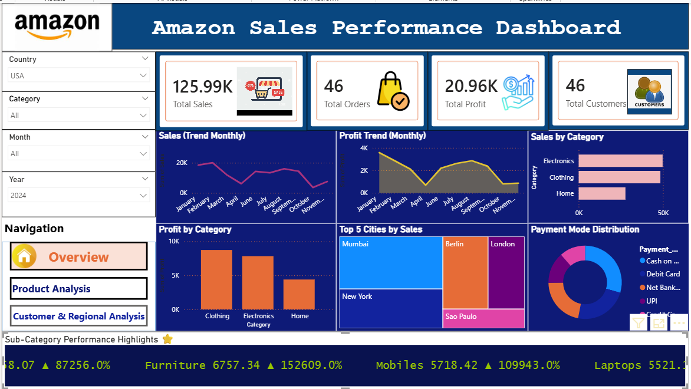
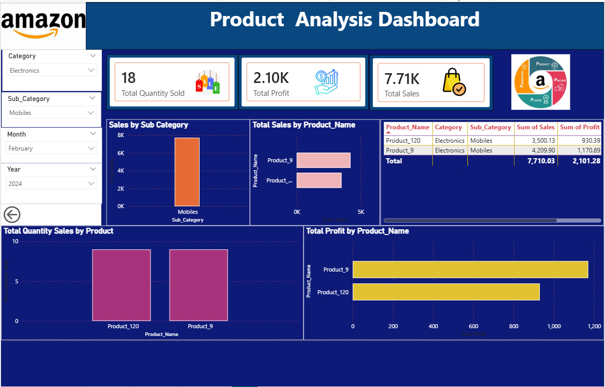
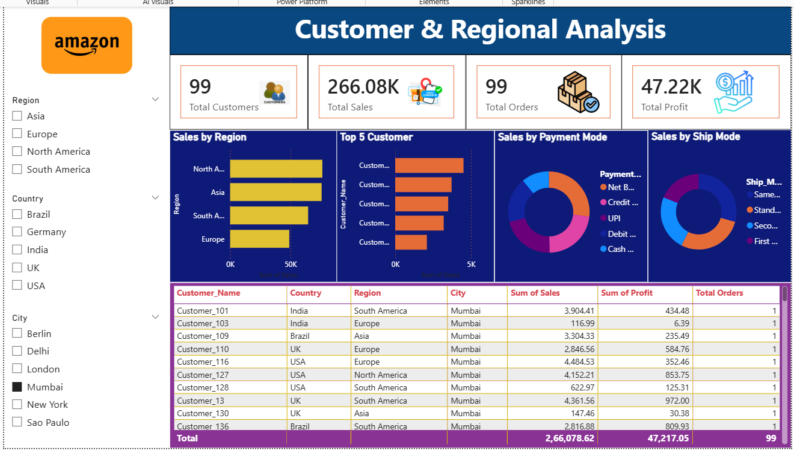

Amazon Sales Performance Dashboard | Power BI
📌 Project Overview

This project presents an interactive Amazon Sales Performance Dashboard developed in Microsoft Power BI. The dashboard provides actionable insights into sales performance, product profitability, customer behavior, and regional trends through an intuitive three-page report. It enables users to explore key business metrics using interactive filters and dynamic visualizations for better decision-making.

🎯 Project Objectives
Analyze overall sales performance.
Monitor monthly sales and profit trends.
Identify top-performing product categories and products.
Evaluate customer purchasing behavior.
Compare sales across regions and cities.
Analyze payment and shipping preferences.
Build an interactive business intelligence dashboard.

📄 Dashboard Pages
📍 Page 1 – Amazon Sales Overview

Key KPIs

Total Sales
Total Orders
Total Profit
Total Customers

Visualizations

Monthly Sales Trend
Monthly Profit Trend
Sales by Category
Profit by Category
Top 5 Cities by Sales
Payment Mode Distribution

Filters

Country
Category
Month
Year

📍 Page 2 – Product Analysis

Key KPIs

Total Sales
Total Profit
Total Quantity Sold

Visualizations

Sales by Sub-Category
Sales by Product
Profit by Product
Quantity Sold by Product
Product Details Table

Filters

Category
Sub-Category
Month
Year
📍 Page 3 – Customer & Regional Analysis

Key KPIs

Total Customers
Total Sales
Total Orders
Total Profit

Visualizations

Sales by Region
Top 5 Customers
Sales by Payment Mode
Sales by Shipping Mode
Customer Details Table

Filters

Region
Country
City

🛠️ Tools & Technologies

Microsoft Power BI
Power Query
DAX
Data Modeling
Data Visualization
📈 Skills Demonstrated
Data Cleaning
Data Modeling
DAX Measures
KPI Design
Dashboard Development
Business Intelligence
Interactive Reporting
Data Visualization

📂 Project Structure
Amazon-Sales-Performance-Dashboard/
│
├── Amazon Sales Dashboard.pbix
├── Amazon Sales Dataset.xlsx
├── Dashboard Screenshots/
│   ├── .png
│   ├── Page2_Product_Analysis.png
│   └── Page3_Customer_Regional_Analysis.png
├── README.md
└── LICENSE

📷 Dashboard Screenshots
Page 1 – Amazon_Salesperformance

Page 2 – Product_Analysis

Page 3 – Customer & Regional Analysis

💡 Key Business Insights
Monitored sales, profit, and customer performance using KPI cards.
Identified top-performing products and categories.
Compared monthly sales and profit trends.
Analyzed customer purchasing behavior across regions.
Evaluated payment methods and shipping preferences.
Built an interactive dashboard for business decision-making.
📬 Connect With Me

Sapna Gupta

💼 LinkedIn:https://www.linkedin.com/in/sapna-gupta-/
💻 GitHub: https://github.com/gupta7977290910-droid/Amazon-Sales-Performance-Dashboard/edit/main/README.md
📧 Email: gupta7977290910@gmail.com

